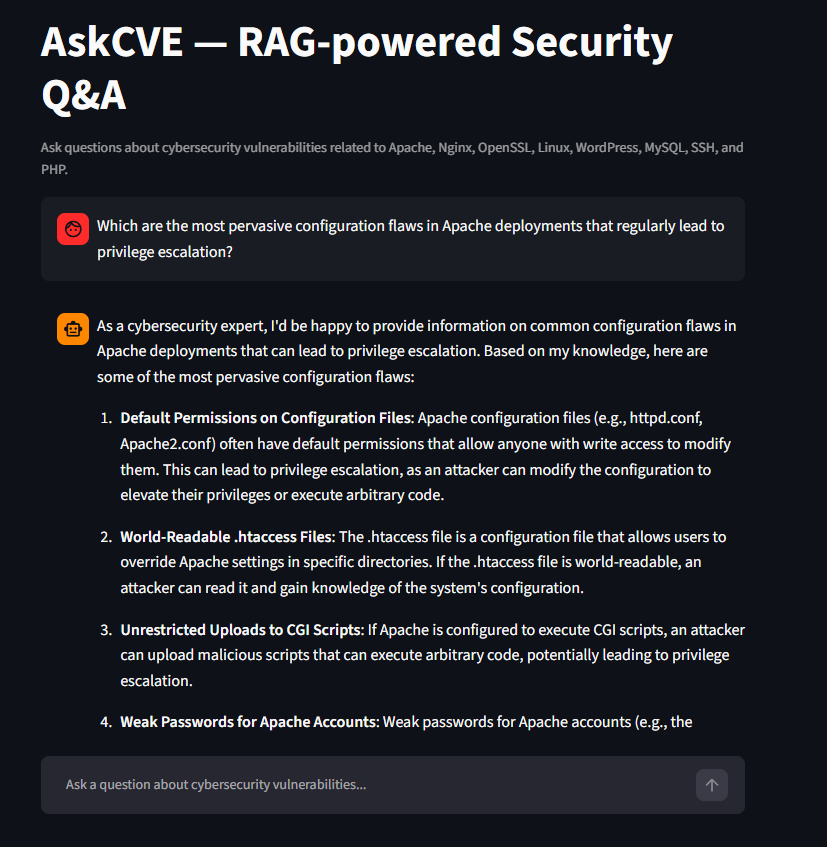

# AskCVE — RAG-powered Security Q&A

A question-answering system about real security vulnerabilities, built with Retrieval-Augmented Generation (RAG). Ask questions in natural language and get answers grounded in actual CVE data from the National Vulnerability Database (NVD).


---

## What is this?

Instead of asking a generic AI about vulnerabilities, this tool:

1. Fetches real CVEs from the NVD public API (Apache, Nginx, OpenSSL, Linux, WordPress, MySQL, SSH, PHP)
2. Converts each CVE description into a vector embedding and stores it in ChromaDB
3. When you ask a question, finds the 5 most semantically similar CVEs
4. Sends those CVEs as context to Llama 3.1 (via Groq) to generate a grounded answer

The result is a chatbot that reasons over real vulnerability data — not hallucinations.

---

## Screenshots

<p>
  
</p>

---

## Tech Stack

| Component | Tool | Cost |
|---|---|---|
| LLM | Llama 3.1 8B via Groq API | Free tier |
| Embeddings | `sentence-transformers` (all-MiniLM-L6-v2) | Free / local |
| Vector store | ChromaDB | Free / local |
| Orchestration | LangChain | Free |
| Interface | Streamlit | Free |
| Data source | NVD public API | Free |

**Total cost: $0**

---

## Project Structure

```
.
├── config.py       # API keys and model settings
├── ingest.py       # Fetches CVEs from NVD and indexes them into ChromaDB
├── app.py          # Streamlit chat interface
└── chroma_db/      # Vector database (auto-generated on first run)
```

---

## Setup

### 1. Clone the repository

```bash
git clone https://github.com/your-username/cve-assistant.git
cd cve-assistant
```

### 2. Install dependencies

```bash
pip install langchain langchain-groq chromadb sentence-transformers requests streamlit
```

### 3. Get a free Groq API key

Go to [console.groq.com](https://console.groq.com), create an account, and generate an API key.

### 4. Configure

Edit `config.py` and replace the placeholder:

```python
GROQ_API_KEY = "your_api_key_here"
```

> ⚠️ Add `config.py` to `.gitignore` before pushing to GitHub.

### 5. Index the CVEs (run once)

```bash
python ingest.py
```

This fetches ~800 CVEs across 8 software categories and stores them in ChromaDB. Takes a few minutes on first run.

### 6. Start the app

```bash
python -m streamlit run app.py
```

Opens at `http://localhost:8501`

---

## Example Questions

- *Which vulnerabilities allow arbitrary code execution on Apache?*
- *What are the most critical OpenSSL vulnerabilities?*
- *Are there any CVEs related to WordPress authentication bypass?*
- *What buffer overflow vulnerabilities exist in MySQL?*

---

## How RAG Works

```
User question
     │
     ▼
[SentenceTransformer]
  question → vector
     │
     ▼
[ChromaDB]
  find 5 most similar CVE vectors
     │
     ▼
[Groq / Llama 3.1]
  prompt = instructions + 5 CVEs + question
  → generates grounded answer
     │
     ▼
Answer displayed in Streamlit chat
```

---

## Covered Software

Apache · Nginx · OpenSSL · Linux Kernel · WordPress · MySQL · SSH · PHP

---

## License

MIT
